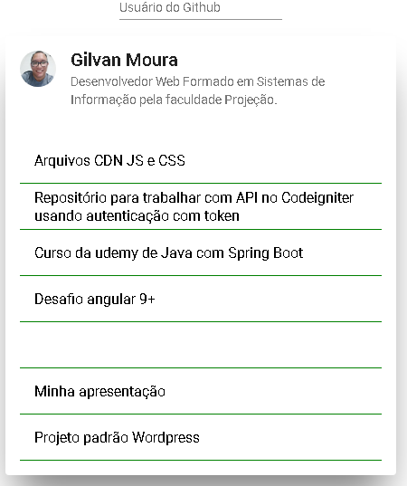

# DesafioAngular

### Angular 11.2.8
### Angular Material
### NgRx
### Flex Layout
### Testes Unitários
### Layout Responsivo
### Github API

## Rodar o projeto
Step 1.  Fazer o clone do projeto do Github
 
Step 2.  Rodar o comando `npm install`
 
Step 3.  Rodar o comando ou os comandos para o start do projeto localmente: `ng serve` ou `npm start`
  
Tudo saindo como planejado, deve apresentar esta tela:
  

## Build
Para gerar a build, execute o comando  `ng build`.
 

## Run unit tests / Rodar testes unitarios

Execute o comando `ng test` para rodar os testes via [Karma](https://karma-runner.github.io).
 
Obs.: O comando deve abrir uma janela no navegador exemplo: `http://localhost:9876/`

