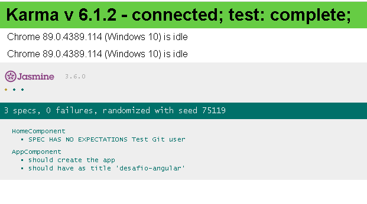

# DesafioAngular

### Angular 11.2.8
### Angular Material
### NgRx
### Flex Layout
### Testes Unitários
### Layout Responsivo
### Github API

## Rodar o projeto
Step 1.  Fazer o clone do projeto do Github
 
Step 2.  Rodar o comando `npm install`
 
Step 3.  Rodar o comando ou os comandos para o start do projeto localmente: `ng serve` ou `npm start`

## Start
Run `npm start` to execute the application in browser at port 5200

## Build

Run `ng build` to build the project. The build artifacts will be stored in the `dist/` directory. Use the `--prod` flag for a production build.

## Run unit tests / Rodar testes unitarios

Run `ng test` to execute the unit tests via [Karma](https://karma-runner.github.io).
 
Obs.: O comando deve abrir uma janela no navegador exemplo: `http://localhost:9876/`

